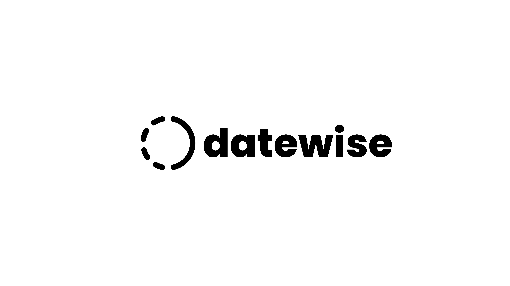

<div style="text-align:center;" align="center">A better Google Calendar
<br>
    <a href="https://datewise.zshlabs.tech"><strong>Learn more »</strong></a>
    <br>
        <a href="https://datewise.zshlabs.tech">Website</a>
    ·
    <a href="https://github.com/zshlabs/datewise/issues">Issues</a>
</div>

## About this project

Datewise is the best calendar where you can find the best design and best workflows, integrations, and many more.

This project was inspired by this tweet [https://twitter.com/theanuragdev/status/1740689256115507480](https://twitter.com/theanuragdev/status/1740689256115507480)

Datewise aims to be open first and privacy-first calendar, that can be self-hosted and can be used by anyone.
Join us in our journey to build the best calendar.

<div style="text-align:center;"> -
<a href="https://twitter.com/theanuragdev">
 @anuragts 
 </a>
 </div>


## Contributing

- To contribute, please see our [contribution guide](https://github.com/zshlabs/datewise/blob/main/CONTRIBUTING.md).

## Contact us

Please feel free to contact us if you are interested in our Enterprise plan for large organizations that need extra flexibility and control.

<a href="https://app.cal.com/anuragtsx/datewise-pricing?utm_source=banner"></a>


## Tech Stack

- [Typescript](https://www.typescriptlang.org/) - Language
- [Next.js](https://nextjs.org/) - Framework
- [Supabase](https://supabase.com/) - Database
- [Prisma](https://www.prisma.io/) - ORM
- [Tailwind](https://tailwindcss.com/) - CSS
- [shadcn/ui](https://ui.shadcn.com/) - Component Library
- [Clerk](https://clerk.com/) - Authentication
- [react-email](https://react.email/) - Email Templates
- [Stripe](https://stripe.com/) - Payments
- [Vercel](https://vercel.com) - Hosting

## Local Development

### Requirements

To run Datewise locally, you will need

- Node.js
- Postgres SQL Database


## Developer Setup

### Manual Setup

> [!TIP]
> Use [pnpm](https://pnpm.io/) for fast installation and efficient disk management.

Follow these steps to setup Datewise on your local machine:

1. [Fork this repository](https://docs.github.com/en/pull-requests/collaborating-with-pull-requests/working-with-forks/about-forks) to your GitHub account.

After forking the repository, clone it to your local device by using the following command:

```sh
git clone https://github.com/<your-username>/datewise
```

2. Run `npm i` in the root directory

3. Create your `.env` from the `.env.example`. You can use `cp .env.example .env` to get started with our handpicked defaults.

4. Set the following environment variables:

   - DATABASE_URL
   - NODE_ENV
   - NEXT_PUBLIC_CLERK_PUBLISHABLE_KEY
   - CLERK_SECRET_KEY
   
5. Create the database schema by running `npm run prisma:migrate-dev`

6. Run `npm run dev` in the root directory to start

7. Register a new user at http://localhost:3000/auth/register


### Run in Gitpod

- Click below to launch a ready-to-use Gitpod workspace in your browser.

[](https://gitpod.io/#https://github.com/zshlabs/datewise)

### Run in DevContainer

We support DevContainers for VSCode. [Click here to get started.](https://vscode.dev/redirect?url=vscode://ms-vscode-remote.remote-containers/cloneInVolume?url=https://github.com/zshlabs/datewise)


Created by [zsh labs](https://zshlabs.tech) with ❤️

Follow us on [Twitter](https://twitter.com/theanuragdev) for updates. :)


